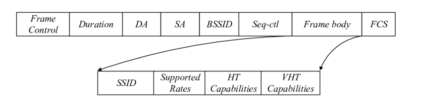

# Proxii Documentation

### Table of Contents

- [Proxii Documentation](#proxii-documentation)
    - [Table of Contents](#table-of-contents)
- [Introduction](#introduction)
- [Context](#context)
  - [Manual Installation](#manual-installation)
    - [Dependencies](#dependencies)
      - [Ubuntu](#ubuntu)
      - [Fedora](#fedora)
      - [Arch Linux](#arch-linux)
    - [Installation](#installation)
- [Running Proxii](#running-proxii)
  - [Troubleshooting](#troubleshooting)
    - [Common Issues](#common-issues)
- [TODO](#todo)
- [Technical Details](#technical-details)
  - [Code Structure and Readability](#code-structure-and-readability)
- [Skill Set](#skill-set)
    - [Summary about Probe Requests](#summary-about-probe-requests)
    - [So, How do we transfer data ?](#so-how-do-we-transfer-data-)
  
# Introduction

Proxii is a **Linux Only** **secure**, **proximity chat**, using the *802.11 WLAN protocol*, it use a creative way to make custom Probe Requests to transmit messages between devices in a local area.

# Context

In a world where privacy is disappearing, Proxii offers a secure and discrete way to communicate with others close person. And because im a student, i wanted to make a project that is useful and fun to use, and also to learn new things about networking and security. 

## Manual Installation

To install Proxii, you need to have the following dependencies installed:

- Python 3.8 with pip or higher (Tested on Python 3.12)
- net-tools
- wireless_tools
- iw
- tshark (basicly wireshark_cli)

To install the dependencies, you can run the following commands:

### Dependencies

#### Ubuntu
```bash
sudo apt update
sudo apt install python3 python3-pip net-tools wireless_tools wireshark_cli
```

#### Fedora
```bash
sudo yum install python3 python3-pip net-tools wireless_tools wireshark_cli
```

#### Arch Linux
```bash
sudo pacman -S python python-pip net-tools wireless_tools wireshark_cli
```

### Installation

To install Proxii, you can run the following commands:

```bash
git clone https://github.com/H-FTM/ProbeChat.git
cd Proxii
pip install -r requirements.txt
```

# Running Proxii

To run Proxii, you can run the following command:

```bash
sh start.sh
```

## Troubleshooting

If you have any issues with Proxii, you can open an issue on the GitHub repository 

### Common Issues

- No wifi when using the chat : It is normal if u only have 1 network interface, it have to put the interface in monitor mode, that will disconnect you from Wifi.

- Sometimes it can happens, that messages doesnt come up entirely, this can be due to a weak signal, try to get closer to the other device or change channel to a less used one using ```!c {channel}``` command in the chat.

- **Proxii cannot find the network interface** : Make sure that the network interface is up and running, you can use the `ifconfig` command to check the network interfaces.

- **Proxii was unable to find necessary dependencies** : Haha you didnt read the documentation, go back and install the dependencies.

- **_curses.error: addwstr() returned ERR** : You're terminal is too small for Proxii to run the interface correclty, try to resize your term

- **Decompression Failed** : The user tried to transmit a too big file on a too noisy channel or weak transmitter, so file arrived corrupted.

- **No wifi after using Proxii** : You have to put the interface back in managed mode because it failed to put it back, you can do it by running the following command: ```sudo airmon-ng stop {interface}```

# TODO

- [ ] Adding relay possibilities
- [ ] Adding Chat Discovery (discover users on same chat at join)
- [ ] Sending multiple files, directory
- [ ] Making Web interface
- [ ] Adding Voice Chat
# Technical Details

## Code Structure and Readability
The code is structured in a way that is easy to read and understand  The code is divided into multiple files, each with a specific purpose. The code is also well-documented as you can see here and i put much comments explaining the purpose of each function and class.

# Skill Set
- Python
- Networking
- Security
- Linux
  
### Summary about Probe Requests
Probe requests are basicly a packet askin "Are you here" by requesting wifi from their SSID (Name) that will answer with a probe response, making network discovery faster.

### So, How do we transfer data ?
**Proxii use a innovative approach to do it.**

Probe requests structure : 



---
Proxii constructs custom probe request frames that look like regular ones in order to be discrete to sniffers.

The script will uses a dictionary created from the Python random library, with the user's password serving as a seed. This approach ensures a highly resistant protocol against packet sniffing attacks.

Proxii then encodes the message into the "Supported Rates" field of the probe request, which is usually a list of supported data rates for communication. By manipulating this field, Proxii hides data in plain sight.

Example:

- Message: `HELLO`
- Encoded in Probe Request as: `0x22 0xB1 0x32 0x32 0x1F`
- Appears in the packet as: `Supported Rates: 0x22 0xB1 0x32 0x32 0x1F`

Like this, Proxii disguises data as part of the probe request, allowing secure and discrete communication.
